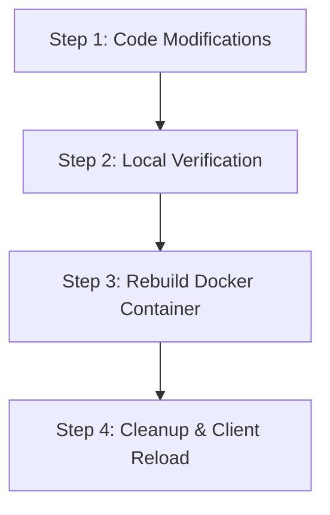

# Developer Update & Deployment Pipeline

This document outlines the standard step-by-step development pipeline to follow whenever you make changes to the **LightRAG MCP Server** codebase. Following this pipeline ensures your changes are safe, fully tested, and cleanly propagated to your active MCP desktop clients (like Cursor, Zed, or Claude Desktop).

---

## The 4-Step Pipeline Overview



---

## Step 1: Code Modifications

All core server logic resides in the `src/lightrag_mcp/` directory.

### Key Files:
* **[server.py](file:///home/antonio/Documents/Python/lightrag-mcp/src/lightrag_mcp/server.py)**: Exposes MCP tools and defines their parameters, titles, descriptions, and semantic constraints.
* **[client.py](file:///home/antonio/Documents/Python/lightrag-mcp/src/lightrag_mcp/client.py)**: Async client wrapper communicating with the underlying LightRAG REST service.
* **[config.py](file:///home/antonio/Documents/Python/lightrag-mcp/src/lightrag_mcp/config.py)**: Environment configuration using Pydantic Settings.

### Best Practices when editing tools:
When adding or updating tools in `server.py`, always utilize the full power of `fastmcp`'s decorator properties and the Model Context Protocol annotations to ensure optimal LLM dispatching and safety:

```python
@mcp.tool(
    title="Human-Readable Tool Title",
    description="Detailed explanation of what the tool does, including strict domain boundaries and when NOT to call it.",
    tags={"category-tag", "domain-tag"},
    annotations=ToolAnnotations(readOnlyHint=True, idempotentHint=True)
)
async def my_new_tool(param: str) -> str:
    # ...
```
* **Guard against pollution**: Explicitly list the target domain (e.g. *Rust, gRPC, QUIC*) and add negative bounds (e.g. *"Do NOT run this tool for Python or Javascript tasks"*) in the `description` parameter.
* **Leverage annotations**: Always set `readOnlyHint=True` and `idempotentHint=True` for query tools to enable client-side caching and skip manual confirmation prompts.

---

## Step 2: Local Verification (Testing)

Before packaging the changes, always run the local test suite using the `uv` package manager. This verifies that your changes did not introduce any regressions, syntax errors, or input validation bugs.

Run the entire suite of 15 mock and unit tests:
```bash
uv run pytest
```

> [!TIP]
> The test suite is fully asynchronous and completely mocked out (using `pytest-mock` and pure-mock asyncio clients), meaning it completes in **under 1 second** without requiring a running LightRAG REST service!

---

## Step 3: Rebuild the Docker Container

Since your MCP client runs the server inside a Docker container (as configured in `mcp_config.json`), any modifications made to local `.py` files **will not take effect** until you compile a fresh Docker image.

To rebuild the container:
```bash
docker build -t lightrag-mcp .
```

> [!NOTE]
> The `Dockerfile` is highly optimized with multi-stage build-caching. If your `pyproject.toml` dependencies did not change, Docker will reuse the cached virtual environment and rebuild only your modified source files in **under 5 seconds**!

---

## Step 4: Cleanup & Client Reload

Because MCP stdio servers run as long-running subprocesses, your host editor may have active containers already running in the background. Simply rebuilding the image won't kill active containers.

Follow these two cleanup steps to cleanly swap in your new code:

### 1. Terminate Stale background Containers:
Force-kill any running containers associated with `lightrag-mcp` to reclaim memory and clear orphaned sessions:
```bash
docker ps -q --filter ancestor=lightrag-mcp | xargs -r docker rm -f
```

### 2. Reload Your Editor/Client:
Force your host editor/client to spawn a brand new container instance running your freshly-built image:
* **Cursor**: Open the Command Palette (`Ctrl+Shift+P` / `Cmd+Shift+P`) and select **"Developer: Reload Window"**, or go to Settings -> MCP and click the "Refresh" button next to `lightrag-mcp`.
* **Zed**: Restart the Zed assistant or reload the workspace.
* **Claude Desktop**: Fully restart the Claude Desktop application from your system tray.

Once reloaded, your client will instantly launch a fresh container executing your newly updated server code!
